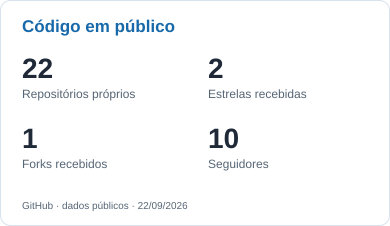
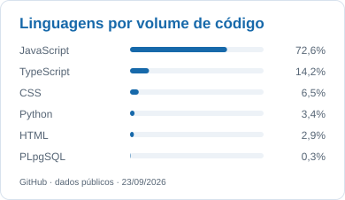

<h1 align="center">João Marcos · Jocowski</h1>

  

  Desenvolvo aplicações web e mobile, integrações e automações. 
  Fora do código, gosto de jogos de estratégia e simulação.

  
  
  

## Tecnologias que uso

**Linguagens**

  
  
  
  

JavaScript · TypeScript · Python · PHP

**Web, mobile e aplicações**

  
  
  
  
  
  

Node.js · React · React Native · Vue.js · Flutter · Electron · Moleculer

**Dados e infraestrutura**

  
  
  
  
  
  

PostgreSQL · MySQL · MongoDB · Redis · AWS SQS · Docker · Kubernetes · Heroku

**No dia a dia:** GitHub, GitLab e DBeaver. 
**Ferramentas de IA:** Claude Code, Codex e Cursor.

## Atividade no GitHub

  <picture>
    <source media="(prefers-color-scheme: dark)" srcset="./assets/stats-dark.svg" />
    
  </picture>
  <picture>
    <source media="(prefers-color-scheme: dark)" srcset="./assets/languages-dark.svg" />
    
  </picture>

As linguagens representam o código dos repositórios públicos próprios, sem forks, e não o nível de domínio.

  <picture>
    <source media="(prefers-color-scheme: dark)" srcset="./assets/github-contribution-grid-snake-dark.svg" />
    
  </picture>

<!-- Referências de composição: github.com/salesp07/salesp07 e github.com/DenverCoder1/DenverCoder1. -->
